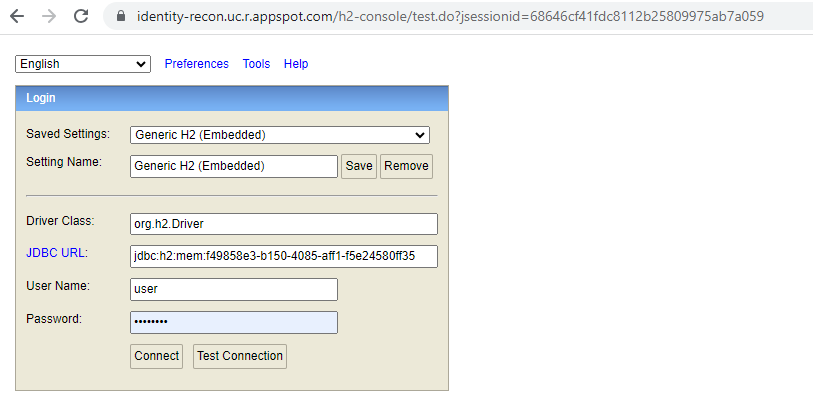
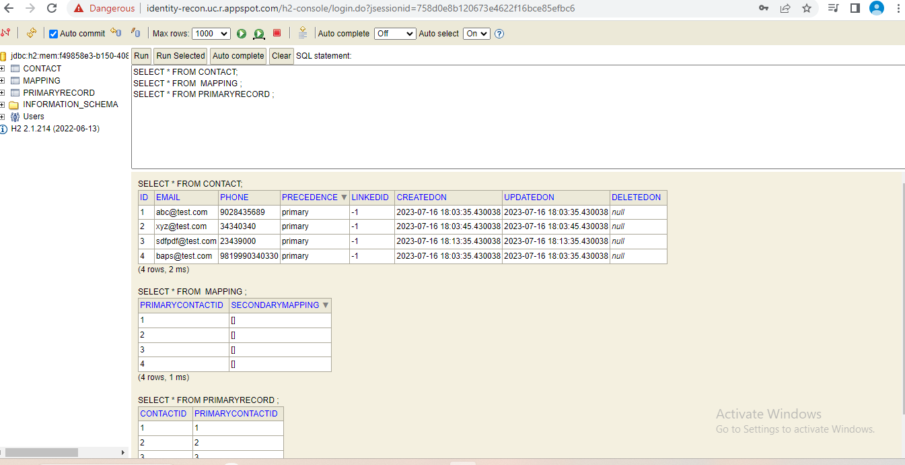

# IdentityReconciliation

Identity reconciliation service which handles user reconciliation, identification and merging user contacts.

#### Steps to run the app locally
Pre-requisites : Java 8 and Maven must be installed
1. Clone the project and build to create the jar using the command
> mvn clean install
2. Run the jar using the command
> jar -jar path/to/jar/
3. Use any API testing tool like POSTMAN and hit the url http://localhost:8080/identify
4. Sample Curl Request :
> curl --location 'localhost:8080/identify' \
--header 'Content-Type: application/json' \
--data-raw '{
"email": "sample@email.com",
"phoneNumber": "9092329020"
}'

### Application is hosted at : 
https://identity-recon.uc.r.appspot.com/identify

#### Sample Curl Request : 
>curl --location 'https://identity-recon.uc.r.appspot.com/identify' \
--header 'Content-Type: application/json' \
--data-raw '{
"email": "sample@email.com",
"phoneNumber": "909232902"
}'

#### Response : 
>Response :
{
"contact": {
"primaryContactId": 5,
"emails": [
"sample@email.com"
],
"phoneNumbers": [
"9092329020"
],
"secondaryContactIds": []
}
}

Refer [Design Doc](https://docs.google.com/document/d/1px8OgY_2Lt3jMLxIq18xnPK75ZAOCI-HU3YIHoRW_Sc/edit?usp=sharing)

Please find the resume [here](https://drive.google.com/file/d/17YecebaNPXvTeirTJUMW5zp0qcQhpcXP/view?usp=drive_link)

###
#### Access H2 DB console using the following credentials :
H2-Console Url : https://identity-recon.uc.r.appspot.com/h2-console
JDBC-URL : jdbc:h2:mem:memdb
Username : user
Password : password

#####

###
Querying the tables : 

